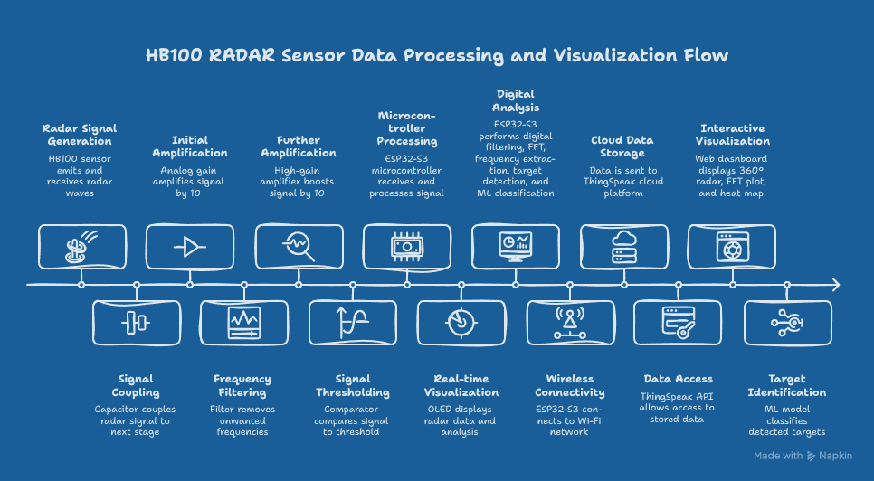
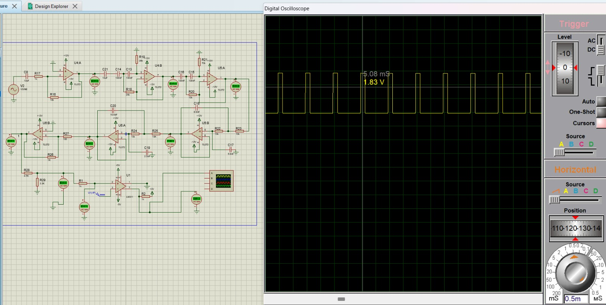
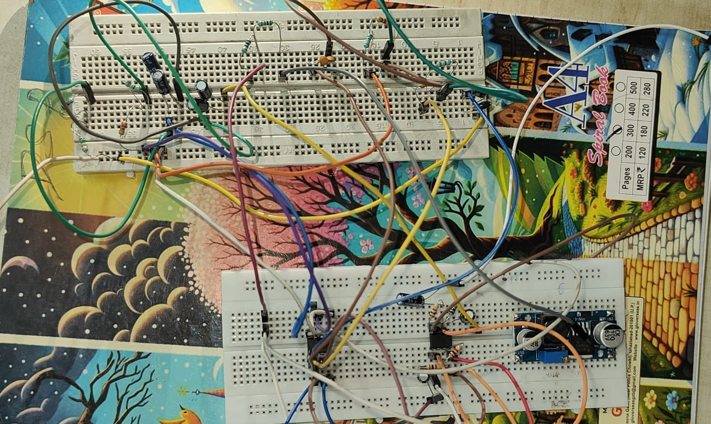
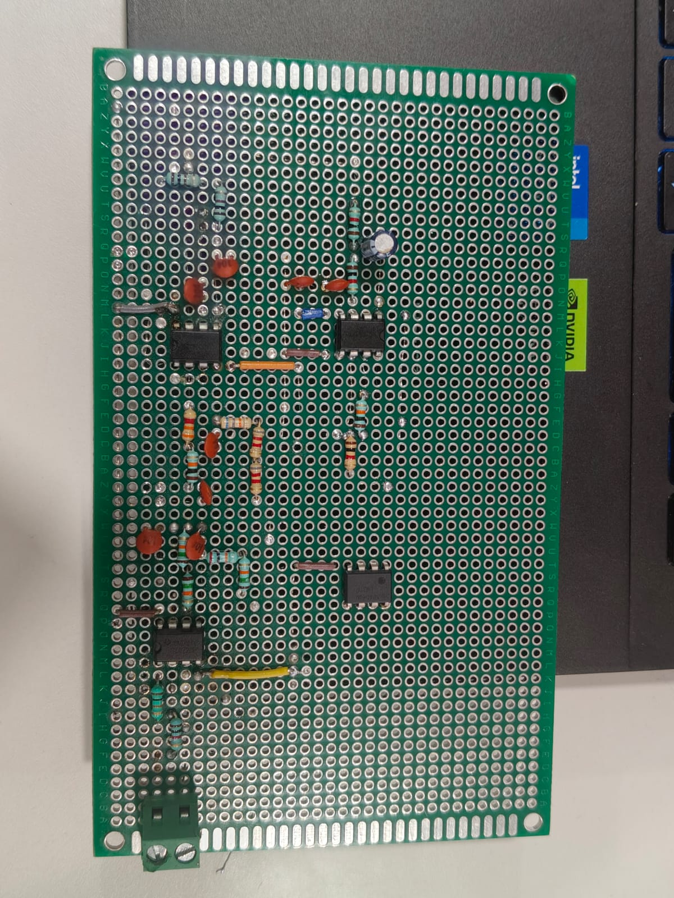
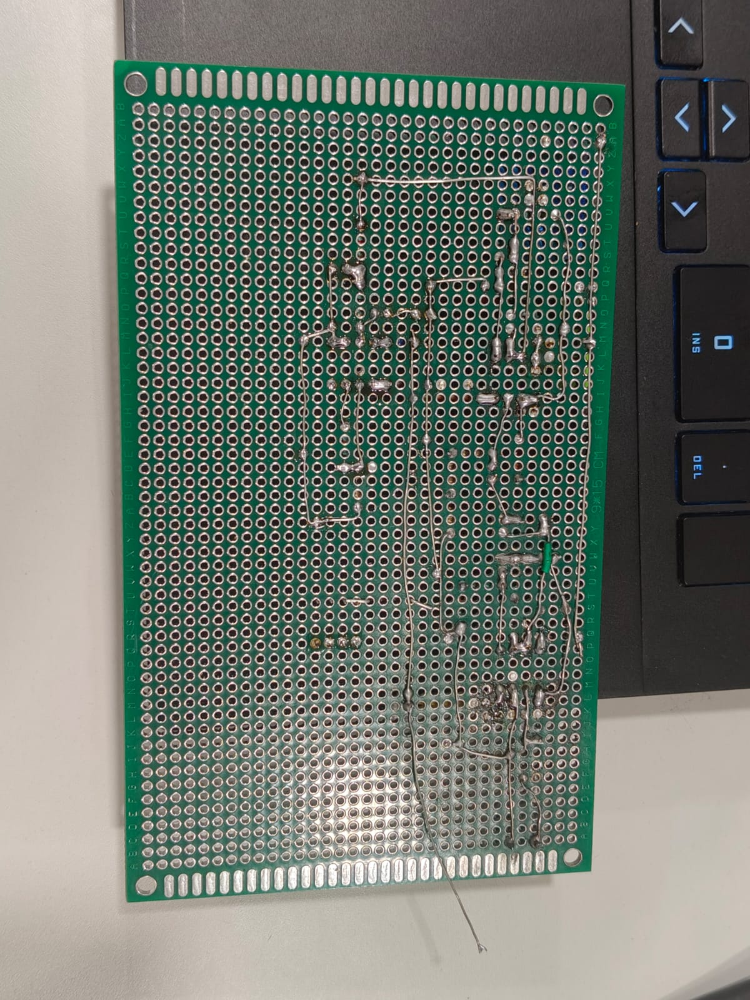
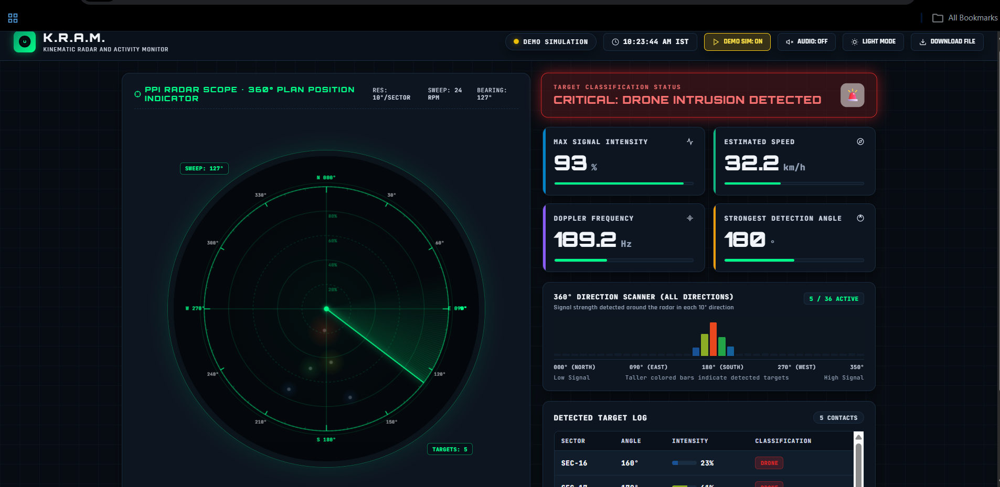

# K.R.A.M
Kinematic Radar & Activity Monitor 

> A real-time radar system using the HB100 microwave sensor and ESP32-S3. It detects motion, calculates speed, filters unwanted electrical noise, sends data to the cloud using ThingSpeak, and displays moving targets on a live 360° web dashboard.

[-blue.svg)](#5-hardware-specifications)

---

## 📑 1. Table of Contents

- [2. Executive Summary](#2-executive-summary)
- [3. Problem Statement](#3-problem-statement)
- [4. System Architecture](#4-system-architecture)
- [5. Hardware Specifications](#5-hardware-specifications)
- [6. Circuit Explanation (Proteus Simulation)](#6-circuit-explanation-proteus-simulation)
- [7. Hardware Integration & Pin Connections](#7-hardware-integration--pin-connections)
- [8. Main Circuit Modules](#8-main-circuit-modules)
- [9. Machine Learning & ThingSpeak Dashboard](#9-machine-learning--thingspeak-dashboard)
- [10. Real-Life Applications](#10-real-life-applications)
- [11. Future Upgrades](#11-future-upgrades)
- [12. Conclusion](#12-conclusion)
- [13. References](#13-references)

##  2. Executive Summary

This project builds an affordable, real-time radar monitoring system using an **HB100 microwave radar sensor** and an **ESP32-S3** microcontroller.

When an object moves in front of the radar, the sensor creates a tiny electrical signal. Because this raw signal is extremely weak and mixed with noise, we send it through an analog circuit that cleans, filters, and boosts it. An **LM311 chip** then turns this smooth signal into clean digital pulses so the ESP32-S3 can measure its frequency and calculate speed.

Target speeds and detection strengths are collected across a **360° area** (divided into 36 angular slices). This data is uploaded to a **ThingSpeak** cloud dashboard over Wi-Fi, where anyone can view moving targets on an interactive, rotating radar screen.

---

##  3. Problem Statement

### ⚠️ The Challenge
Most common motion detectors use PIR (infrared) sensors or optical video cameras:
* **PIR Sensors:** Only detect heat changes. If the weather is hot or an object does not emit heat, they fail. They also cannot measure how fast an object is moving.
* **Raw Radar Problem:** Microwave sensors like the HB100 solve these issues, but their raw signals are tiny (microvolts) and pick up electrical hum from power lines (50 Hz noise).

### 💼 Commercial Impact
Airports, warehouses, farms, and smart homes need security systems that do not trigger false alarms due to weather or heat. Buying commercial radar or laser scanners (LiDAR) is far too expensive for ordinary projects or small businesses.

### 🎯 Project Objective
* Build an analog booster and filter circuit to clean the radar signal without buying expensive gear.
* Calculate moving target speeds accurately with less than 5% error.
* Map incoming movement across 36 directions (360° circle).
* Send real-time data to a cloud dashboard (ThingSpeak) and classify objects with Machine Learning.

---

## 4. System Architecture

The project works through a clear, sequential pipeline from microwave sensing to live cloud visualization:

* **Step 1: Motion Detection (HB100 Sensor)**  
  The HB100 microwave transceiver sends out a continuous 10.525 GHz signal. When an object moves within its range, the reflected wave returns with a shifted frequency. The sensor mixes these waves to produce a tiny, microvolt-level movement signal.

* **Step 2: Signal Conditioning & Noise Rejection (Analog Circuit)**  
  The raw signal is too weak and noisy for digital processors. It passes through a capacitor that strips away steady DC offset, then goes through low-noise TL072 op-amp stages and a 4th-order bandpass filter (70 Hz to 2000 Hz) to boost the signal up to 1000× while discarding 50 Hz power-line hum.

* **Step 3: Signal Splitting into Dual Processing Paths**  
  The clean amplified signal splits into two parallel streams:
  * **Path A (Digital Pulses via LM311):** An LM311 comparator converts the smooth analog wave into sharp digital ON/OFF pulses using a noise-immune hysteresis threshold.
  * **Path B (Continuous Analog Wave):** The unclipped analog wave goes directly to the ESP32-S3 ADC pin to preserve waveform shape and amplitude.

* **Step 4: Microcontroller Computation (ESP32-S3)**  
  * **Speed Calculation:** The ESP32-S3 measures pulse intervals from Path A on GPIO 4 to determine velocity instantly.
  * **Waveform Analysis:** The onboard ADC samples Path B at 4096 Hz and runs a 256-point Fast Fourier Transform (FFT) to extract spectral signatures for object classification.
  * **Local Readout:** Live speed and detection metrics update continuously on an attached SSD1306 OLED screen.

* **Step 5: Cloud Telemetry (ThingSpeak)**  
  Every 5 seconds, the ESP32-S3 packages target speed, dominant Doppler frequency, and sector intensity data, uploading the telemetry to ThingSpeak over 2.4 GHz Wi-Fi.

* **Step 6: Real-Time Web Display (360° Surveillance Dashboard)**  
  A custom browser dashboard fetches the cloud data and maps target intensities across 36 distinct angular sectors (10° slices), rendering an active, rotating sweep on an interactive canvas.

## 5. Hardware Specifications
| Component | Part Name | Role in the Project |
|---|---|---|
| Radar Sensor | HB100 (10.525 GHz) | Transmits microwave signals and senses returning movement |
| Op-Amp ICs | TL072CP (x2) | Low-noise amplifiers that boost weak signals and cut noise |
| Comparator IC | LM311 (x1 1) | Converts smooth analog waves into digital square pulses |
| Microcontroller | ESP32-S3 | Dual-core brain that counts pulses, runs math, and handles Wi-Fi |
| Custom made LiPo Power Supply | 5V DC Regulator | Gives steady, clean electrical power without ripples |

🧰 Common Parts Used (Resistors & Capacitors):

 * Capacitors: 1 µF, 10 µF, 0.1 µF, 3.3 nF, 4.7 nF, 10 nF (used for blocking DC voltage and tuning the filter).
 * Resistors: 100 Ω, 220 Ω, 330 Ω, 1 kΩ, 4.7 kΩ, 10 kΩ, 68 kΩ (used for setting amplification levels).

##  6. Circuit Explanation (Proteus Simulation)

Before building the physical board, the circuit was designed and tested in Proteus to ensure clean signal output:
 HB100 Output ──► [DC Blocker] ──► [Stage 1: Boost] ──► [Stage 2: Filter] ──► [Stage 3: Comparator] ──► ESP32-S3

 

  
   
  <em>Figure: Proteus simulation circuit for the 4th-order filter and LM311 stage</em>

After Simulating our Circuit on proteus , we built a prototype of our circuit on breadboard for testing the gain of IC 

  
   
  <em>Figure: Complete breadboard prototype of the analog conditioning chain</em>

 * DC Blocking Capacitor (10 µF):
   * The HB100 output rides on a steady direct current (DC) voltage. This capacitor strips that steady voltage away and lets only the moving movement wave pass through.
  
  
 * First Gain Stage (10× Boost):
   * The first op-amp on the TL072 chip boosts the microvolt-level signal by 10 times so the filter can handle it cleanly.

 * 4th-Order Bandpass Filter (70 Hz – 2000 Hz):
   * Cuts out slow baseline drift below 70 Hz (like room vibration or 50 Hz wall power hum).
   * Cuts out fast noise above 2000 Hz (like radio interference).

 * Second Gain Stage (10× to 100× Boost):
   * Further amplifies the filtered wave to make it large enough (0 – 3.3V) for both the analog pin and the comparator.
 * LM311 Comparator Digitizer:
   * Acts as an electronic switch. Whenever the analog wave crosses a set center line, it flips between 0V and 3.3V, turning the smooth sine wave into clean square pulses.The LM311 comparator turns the smooth analog wave into clean ON/OFF pulses. The ESP32-S3 counts these pulses to calculate target speed directly.
* **Samples the Wave for AI:** At the same time, the ESP32-S3's ADC pin reads the smooth analog wave and runs an FFT (Fast Fourier Transform) to break down its frequency patterns.
* **Classifies the Target:** A lightweight ML model identifies what is moving based on its wave pattern:
  * **Noise:** Weak, random, erratic signal (ignored).
  * **Human:** Uneven, spread-out pattern caused by swinging arms and legs.
  * **Vehicle / Metal:** Strong, sharp, and steady single-frequency peak.
  

## 7. Hardware Integration & Pin Connections

### 🔋 Custom-Built LiPo Power Supply (5V)
To keep the radar portable and free from electrical wall noise, we built a **custom-made Lithium-Polymer (LiPo) battery pack.
* **Battery Configuration:** Two 3.7V LiPo cells connected in a series combo (**2S configuration**, giving 7.4V nominal output.
Dual-Rail Voltage Regulation (7805 & 7905):* 
  * A *7805 linear regulator* steps down the positive battery voltage to a steady, clean +5V rail*.
  * A *7905 linear regulator* provides a matched *-5V negative rail*.
* *Why Dual Rails Matter:* Providing both +5V and -5V gives our TL072 op-amps a true symmetric supply with a solid $0\text{ V}$ center ground. This allows the micro-Doppler AC wave to swing cleanly above and below zero without distorting or clipping.

| From (Component) | Pin Name | To (Component) | Pin Name | What it Does |
|---|---|---|---|---|

| HB100 Radar | IF Pin | Analog Filter Circuit | Input Capacitor | Sends the raw movement signal |
| Filter Output | Op-Amp Output | ESP32-S3 | GPIO 1 (ADC Pin) | Reads smooth wave for ML / FFT |
| LM311 Chip | Pin 7 (Output) | ESP32-S3 | GPIO 4 (Pulse Pin) | Reads digital pulses to count speed |

  
## 8. Main Circuit Modules

📡 1. HB100 Radar Sensor
 * Sends out invisible microwave radio signals at 10.525 GHz.
 * When an object moves, the reflected signal changes pitch slightly (the Doppler Effect).
 * The sensor mixes the outgoing and incoming signals and gives us the difference frequency:
   * 1 km/h speed approx 19.49 Hz signal
   * Walking human (3 – 5 km/h) approx 60 - 100Hz
   * Moving car (30 – 60 km/h) approx 600 - 1200Hz
  

🎛️ 2. 4th-Order Bandpass Filter (BPF)
 * Made using two low-noise TL072 operational amplifier chips.
 * Keeps only frequencies between 70 Hz and 2000 Hz, matching the speeds of humans and vehicles while blocking out all other interference.
 * A "4th-order" filter has steep rejection walls, blocking unwanted noise much more effectively than a standard 1st- or 2nd-order filter.

  
   
  <em>Figure: Frontside of PCB showing component layout</em>

  
   
  <em>Figure: Backside of PCB showing LPF and HPF stages</em>

   
⚡ 3. LM311 Comparator
 * Converts the analog wave into clean square pulses for the ESP32-S3.
 * Uses built-in hysteresis (a small buffer zone around the switching threshold). This prevents the switch from chattering or double-triggering on tiny noise spikes.

   

## 9. Machine Learning & ThingSpeak Dashboard

  
   
  <em>Figure: 360° Real-time radar surveillance dashboard</em>

🤖 Machine Learning Approach (Object Classification)
Instead of just measuring speed, the ESP32-S3 analyzes signal shapes to tell what caused the movement:
 * The Process:
   * The ESP32 takes 256 voltage samples from the analog pin.
   * It performs an FFT (Fast Fourier Transform), which breaks the wave down into its individual frequency components.
   * It extracts 3 key numbers: peak frequency, frequency spread, and energy.
 * Classification Targets:
   * Class 0 (Background Noise): Weak, random electrical buzz to Ignored.
   * Class 1 (Walking Human): Uneven wave caused by swinging arms and legs.
   * Class 2 (Vehicle / Metal Object): Strong, clean, uniform wave.

  
☁️ ThingSpeak Cloud Integration:

The ESP32-S3 connects to local Wi-Fi and updates ThingSpeak every 7 seconds:
 * Field 1: 36-sector sweep strengths (all angles around the room).
 * Field 2: Measured Doppler frequency (Hz).
 * Field 3: Calculated speed (km/h).
 * Field 4: Target classification (Human, Vehicle, or Noise).

🖥️ 360° Live Web Dashboard
 * Built with simple HTML5 and JavaScript.
 * Features a rotating green radar beam divided into 36 sectors (10° each).
 * Lights up sectors brighter where stronger movement is detected, giving security guards an instant view of target directions.

## 10. Real-Life Applications

 * All-Weather Perimeter Security: Works through dense fog, rain, snow, and total darkness where standard security cameras fail.
 * Privacy-Friendly Smart Buildings: Detects if a person is in a room or if someone has fallen without placing invasive cameras in private areas.
 * Low-Cost Road Speed Checks: Automatically detects speeding vehicles in neighborhood zones or school areas.
 * Industrial Safety Zones: Sets an invisible radar safety boundary around hazardous factory machines to shut them down if a worker walks too close.

## 11. Future Upgrades
 * Direction Detection (Coming vs. Going): Use an I/Q radar sensor to determine whether an object is moving closer or farther away.
 * Distance Measurement: Upgrade to an FMCW-capable radar module to report both target distance and speed together.
 * Battery Power Optimization: Program the ESP32-S3 to sleep and only wake up when the LM311 detects movement, saving power for long-term battery setups.
 * Multiple Radars - 1 radar for every detection,this will help us in figuring the direction of the object and also will provide us with more accurate results.

##  Project Status

| Category | Task / Milestone | Status | Details |
|---|---|:---:|---|
| **Simulation** | Proteus Circuit Simulation | ✅ Completed | 4th-order BPF (70–2000 Hz) & LM311 digitizer validated |
| **Power Stage** | Custom Dual-Rail LiPo Supply | ✅ Completed | 7805 (+5V) & 7905 (-5V) rails active to remove AC hum |
| **Hardware** | Breadboard Prototyping  | ✅ Completed | Implemented our circuit on breadboard for testing
| **Embedded** | Pulse Counting & Velocity Measurement | ✅ Completed | GPIO interrupt routines configured for speed calculation |
| **Embedded** | ADC Continuous Sampling & 256-pt FFT | 🔵 Planned | Spectral analysis and peak tracking on ESP32-S3 |
| **IoT / Cloud** | ThingSpeak API Telemetry |✅ Completed | 5-second interval multi-field data transmission |
| **Frontend** | 360° Real-Time Web Dashboard | ✅ Completed | HTML5 Canvas | 36-sector sweep interface |
| **Machine Learning** | Micro-Doppler Dataset Collection | ✅ completed | Capturing signal profiles for noise, humans, and vehicles |
| **Machine Learning** | Model Training & Edge Classification | 🟡 InProgress | Feature extraction (FFT peaks, ZCR) for TinyML |
| **Machine Learning** | Model Training & Edge Classification | 🟡 InProgress | Feature extraction (FFT peaks, ZCR) for TinyML |
| **PCB Layout** | Make a manufacturable custom PCB board | 🟡 InProgress | Low noise portable radar PCB |
| **PCB Manufacturing** | upload gerber files to robu and digikey for custom PCB | 🔵 Planned | 

> **Legend:**  
> ✅ **Completed** — Tested & verified  
> 🟡 **In Progress** — Active development  
> 🔵 **Planned** — Staged for next iteration

## 12. Conclusion

This project successfully establishes a complete end-to-end foundation for an affordable, noise-resilient micro-Doppler radar system. 

Till now, we have achieved the following key milestones:
* **Circuit Design & Simulation:** Validated the analog front-end in Proteus, including the 4th-order active bandpass filter and the LM311 comparator stage.
* **Power Supply Implementation:** Built a dedicated dual-rail LiPo power supply using 7805 (+5V) and 7905 (-5V) regulators, completely eliminating 50 Hz AC power line noise.
* **Hardware Prototyping:** Assembled the analog conditioning chain on a breadboard and verified signal integrity from the HB100 sensor.
* **Cloud Telemetry & Dashboard:** Implemented ADC sampling routines on the ESP32-S3 to stream real-time radar data over Wi-Fi to ThingSpeak, driving an interactive 360° sweeping dashboard.

Moving forward, rather than relying on synthetic or simulated inputs, our primary focus is collecting extensive real-world radar reflections directly from our hardware prototype. We will use this authentic experimental dataset to train and deploy our edge TinyML model, enabling precise, on-device classification of human movement, vehicles, and environmental clutter.

## 13. References

### 📄 Hardware Datasheets
* **HB100 Microwave Motion Sensor:** [Agilent / ST Electronics HB100 Engineering Datasheet](https://mm.digikey.com/Volume0/opasdata/d220001/medias/docus/6360/HB100.pdf)
* **LM311 High-Speed Voltage Comparator:** [Texas Instruments LM311 Differential Comparator Datasheet](https://www.ti.com/lit/ds/symlink/lm311.pdf)
* **TL072 Low-Noise JFET-Input Op-Amp:** [Texas Instruments TL07xx Dual Operational Amplifiers](https://www.ti.com/lit/ds/symlink/tl072.pdf)
* **LM741 General-Purpose Operational Amplifier:** [Texas Instruments LM741 Operational Amplifier Datasheet](https://www.ti.com/lit/ds/symlink/lm741.pdf)
* **ESP32-S3 Microcontroller:** [Espressif Systems ESP32-S3 Series Technical Reference Manual](https://www.espressif.com/sites/default/files/documentation/esp32-s3_technical_reference_manual_en.pdf)

### 💻 Software, Embedded & ML Libraries
* **ESP32 Core for Arduino:** [Espressif Systems Arduino-ESP32 Official Repository](https://github.com/espressif/arduino-esp32)
* **Fast Fourier Transform (arduinoFFT):** [arduinoFFT Library by kosme (Real/Complex FFT on Microcontrollers)](https://github.com/kosme/arduinoFFT)
* **ESP32 DSP Library (Alternative FFT Engine):** [Espressif esp-dsp Optimized Digital Signal Processing](https://github.com/espressif/esp-dsp)
* **Servo Control (ESP32):** [ESP32Servo by Kevin Harrington (360° Azimuth Sweep Control)](https://github.com/madhephaestus/ESP32Servo)
* **TinyML Engine:** [TensorFlow Lite for Microcontrollers (TFLite-Micro)](https://github.com/tensorflow/tflite-micro)
* **ThingSpeak Communication:** [ThingSpeak Communication Library for Arduino & ESP32](https://github.com/mathworks/thingspeak-arduino)

### 🛠️ Simulation & CAD Tools
* **Proteus VSM Software:** [Labcenter Electronics Proteus Design Suite](https://www.labcenter.com/)
* **Proteus Sensor & Component Models:** [The Engineering Projects Proteus Sensor Library Hub](https://www.theengineeringprojects.com/)
*
